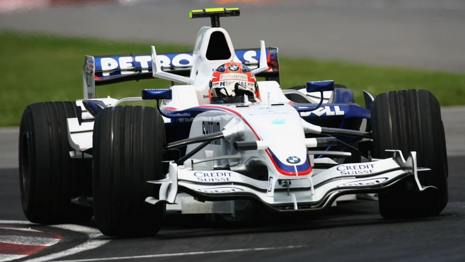

Kariera w F1
============

Kubica zadebiutował w F1 w 2006 roku w zespole BMW Sauber. Jego dynamiczna jazda i szybkie czasy okrążeń szybko przyniosły mu uznanie w stawce. W ciągu kolejnych sezonów zdobywał miejsca na podium, imponując nie tylko prędkością, ale i strategicznym myśleniem.

Tabela wyników w latach 2006-2010
---------------------------------

+-------+------------+------------------------+--------------------------------+
| Sezon | Zespół     | Miejsce w klasyfikacji | Najlepszy wynik                |
|       |            | kierowców              | w wyścigu                      |
+=======+============+========================+================================+
| 2006  | BMW Sauber | 16                     | P3 GP Włoch                    |
+-------+------------+------------------------+--------------------------------+
| 2007  | BMW Sauber | 6                      | P4 GP Hiszpanii, Francji i UK  |
+-------+------------+------------------------+--------------------------------+
| 2008  | BMW Sauber | 4                      | P1 GP Kanady                   |
+-------+------------+------------------------+--------------------------------+
| 2009  | BMW Sauber | 14                     | P2 GP Brazylii                 |
+-------+------------+------------------------+--------------------------------+
| 2010  | Renault    | 8                      | P2 GP Australii                |
+-------+------------+------------------------+--------------------------------+

Kubica zasłynął przede wszystkim dzięki wygranej w Grand Prix Kanady 2008 odnosząc swoje pierwsze i ostatnie zwysicięstwo w F1.

Wypadek w 2011 roku podczas rajdu Ronde di Andora, spowodował poważne obrażenia ręki, co wykluczyło go z wyścigów F1 na kilka lat. Rehailitacja była długa i trudna, a powrót wydawał się nierealny.

   Kubica  w bolidzie BMW Sauber
